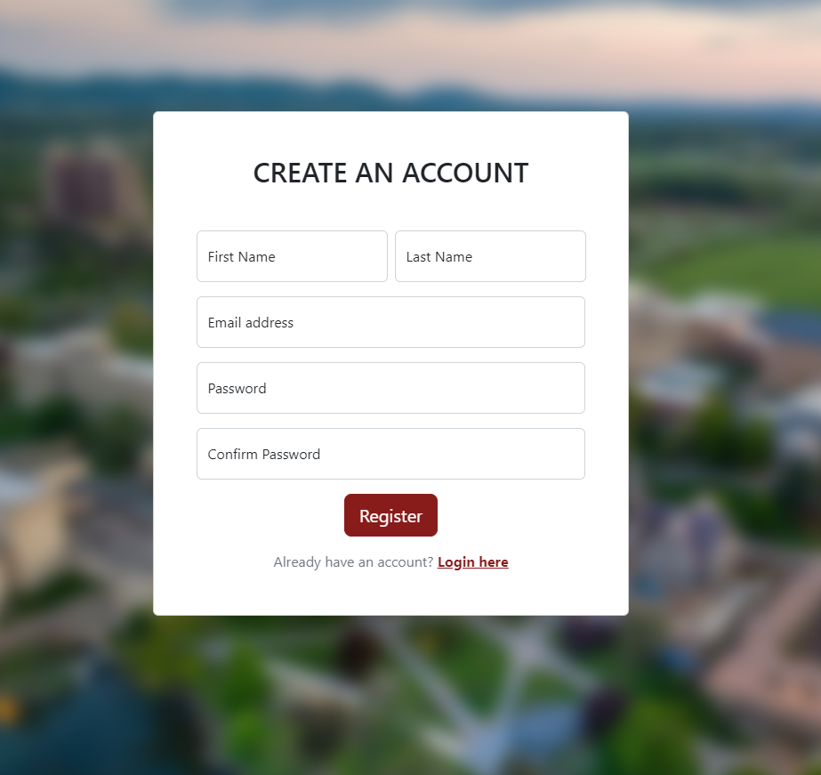

# Team &Pi;: Campus Meet - Final

## Fall 2022

## Overview

Have you ever been on campus, the library was closed, and wanted to find an available space for you and a group to do work or activities? This is was we, the developers of CampusMeet, asked ourselves and we set out to find a solution.

At the core of CampusMeet, we present all rooms that are potentially empty from occupation and available for use. All in a easy to use interface. Furthermore, we allow users on our platforms to save and reserve available rooms for their own informal events, ensuring that no other user on the platform show up to the room they've chosen.

## Team Members

Anthony Zalev - Github Alias: AnthonyZalev

Daniel Melanson - Github Alias: daniel-melanson

Veera Sivarajan - Github Alias: Veera

## User Interface

The general user journey would start by landing on the homepage. Then they would either signup, sign in, or go directly to the campus feed page.

From there if they find a room they may book a room and confirm through the reservation page.

Then they may review, update, or delete reservations in the profile page.

Finally they exit or logout.

### Homepage

### Sign up

### Log in

### Class Feed

### Reservation

### Profile/Personal Reservations

## API

| Method | Endpoint                | Authentication Needed | Description                                                                      |
| :----- | :---------------------- | :-------------------- | :------------------------------------------------------------------------------- |
| GET    | `/api/auth`             | No                    | Return user if signed in, 429 otherwise                                          |
| POST   | `/api/auth/login`       | Yes                   | Sign in, given user password/username                                            |
| POST   | `/api/auth/signup`      | No                    | Signup, given user info                                                          |
| POST   | `/api/auth/logout`      | Yes                   | Logout                                                                           |
| GET    | `/api/availabilities`   | No                    | Return avail. list given filters (building id/room id, date, duration, capacity) |
| GET    | `/api/buildings`        | No                    | Return buildings list                                                            |
| GET    | `/api/events/:id`       | No                    | Return event info, given event id                                                |
| POST   | `/api/reservations/`    | Yes                   | Create reservation, given reservation info                                       |
| GET    | `/api/reservations/`    | Yes                   | get user reservations                                                            |
| PUT    | `/api/reservations/`    | Yes                   | update user reservations                                                         |
| DELETE | `/api/reservations/`    | Yes                   | Delete user reservations                                                         |
| PUT    | `/api/rooms/:id`        | No                    | get room list given building id                                                  |
| PUT    | `/api/rooms/:id/events` | No                    | get event list given building id                                                 |

## Database

We then use a PRISMA database to store the information. PRISMA gives us the querying ease of MongoDB while giving the relational safety of SQL.
We store our data in 5 tables: one for users, rooms, buildings, events and sessions.

The Users table has user data and authentication data. This includes their unique id, first and last name, email, hash, and associated event ids.

The Building table outlines all available buildings on campus and holds each buildings unique id, name, address, and associated rooms.

The Room table holds individual room information including our unique room id, 25 live's room id, associated building id, room number, room title, associated events, capacity, and features. There is also a foreign key relation to the buildings Table

The Events table holds the event unique id, 25live id, roomId, title, start Time, end Time, description, ownerId, organization, and creation Date. It has foreign keys linking to the user table and room table.

The session table has a unique id, device id, data, and a time to live expiration date.

## URL Routes/Mappings

| Route      | Page    | Description                   |
| :--------- | :------ | :---------------------------- |
| `/`        | Home    | Home page                     |
| `/campus`  | Campus  | Campus feed page              |
| `/login`   | Login   | Login Page                    |
| `/signup`  | SignUp  | Sign Up Page                  |
| `/profile` | Profile | User profile and reservations |

## Authentication/Authorization

Once someone is logged in, a profile button with their name shows up and well as a log out button.

If someone is not signed in the navbar has a log in button instead.

if someone tries to reserve a room and is not logged in they will be redirected to the login page.

## Division of Labor

### Milestone 1

- [Daniel Melanson](https://github.com/daniel-melanson)
  - Inital wireframe
  - HTML + CSS for the main page
- [Anthony Zalev](https://github.com/AnthonyZalev)
  - Inital wireframe
  - Final wireframe
- [Veera Sivarajan](https://github.com/veera-sivarajan)
  - HTML + CSS for the calendar for calendar

### Milestone 2

- [Daniel Melanson](https://github.com/daniel-melanson)
  - Backend
  - Frontend scripting
- [Anthony Zalev](https://github.com/AnthonyZalev)
  - Additional Modal HTML
  - Some prototyping
- [Veera Sivarajan](https://github.com/veera-sivarajan)
  - Additional room listings HTML
  - Milestone docs

### Milestone 3

- [Daniel Melanson](https://github.com/daniel-melanson)
  - Home/Login/Signup page html/style
  - Routing for home, login, signup, listings, building, and room pages
  - Connecting RESTful endpoints to DB
  - Authentication and sessions
- [Anthony Zalev](https://github.com/AnthonyZalev)
  - Database Schema work
  - Created Routine for scraping 25live and populating server database
- [Veera Sivarajan](https://github.com/veera-sivarajan)
  - Login page mock up.

### Milestone 4/Final

- [Daniel Melanson](https://github.com/daniel-melanson)
  - Final availabilities finding and integration
  - Adding validations to backend endpoints
  - Building/room scraping from events
  - Misc frontend enhancements
    - Add link to 25live schedule
    - Disable reservation of past availabilities
    - New Availability Listing UI
  - Formatting, linting, dead-code, and quality checks
- [Anthony Zalev](https://github.com/AnthonyZalev)
  - Finalize Web Scraping 25live data (Through DEC 31st, 2022)
  - reservation routing for create, read, update, and delete
  - CREATE route integration to reservation modal
  - Misc Front End Scripting and Integration work
  - documentation
- [Veera Sivarajan](https://github.com/veera-sivarajan)
  - Nothing

## Conclusion

It was rewarding seeing the initial wireframes transform into the finished product. While we didn't achieve everything we set out to do, our final product covers the core functionality we envisioned.

One difficulty was that 25 Live had no public API to query from. Instead we paid close attention to the network calls that were being made when we interacted with the website and narrowed in to the endpoints we needed through careful detective work. We then queried this endpoint in the end for our own project.
