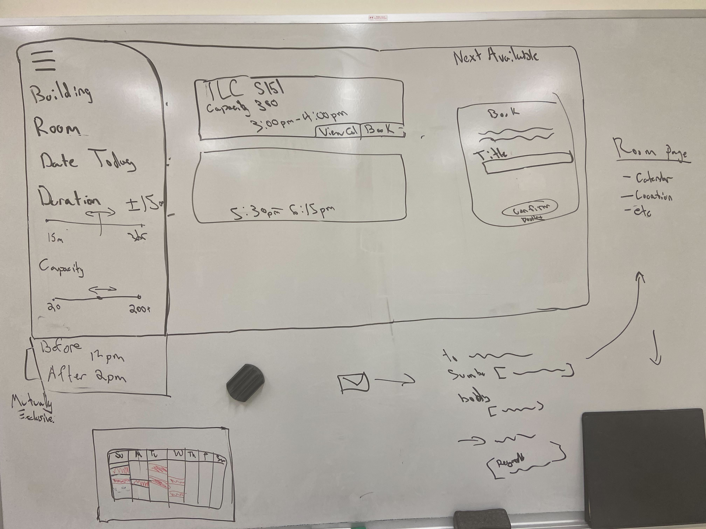
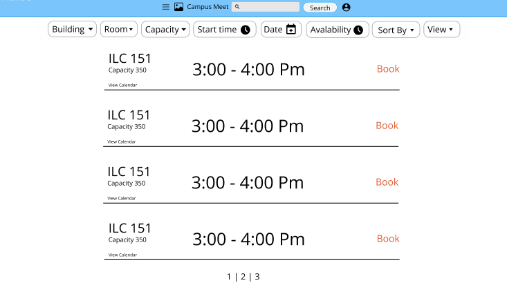
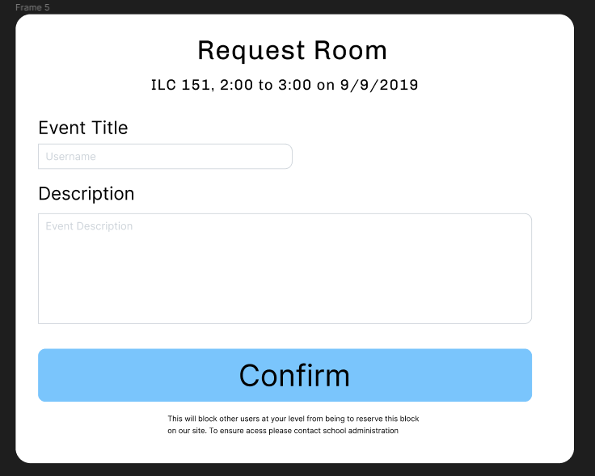

# Team &Pi;: Campus Meet - Milestone 1

## Wireframe

### Initial Wireframe

- Initial wire frame called for a collapsable filter menu one one side. Tiles in the center, and a multi use menu on the far right. You would change view from list to calendar in a header icon not shows.
- Filter would include a searchable building, then room option. Duration and capactity would be sliders.
- Reservation modal would show at the same level as other containers.
### Final Product

- Build on Figma: https://www.figma.com/file/k2q8tJPOWVCbH2MGZYWcVa/Campus-Meet-Wireframe?node-id=0%3A1

- Filter options moved from a side menu to below the header. Dropdowns for building and room will include a checkbox for prior search's and search feature to add additional rooms. Everything else will be check boxes over potential options to filter the "view". 
- Avaiability refers to if the filter shows events, exams, or empty spaces. 
- View refers to the sketched "tile view" or a unshown "calendar" view.

- clicking book will generate a modal at a level above the rest of the web. Can exit by escaping or confirming a time block.

## HTML and CSS

- Screenshots of index, about, and schedule page
- Short descriptions

## Division of Labor

- [Daniel Melanson](https://github.com/daniel-melanson)
  - Inital wireframe
  - HTML + CSS
- [Anthony Zalev](https://github.com/AnthonyZalev)
  - Inital wireframe
  - Final wireframe
- [Veera Sivarajan](https://github.com/veera-sivarajan)
  - HTML + CSS
