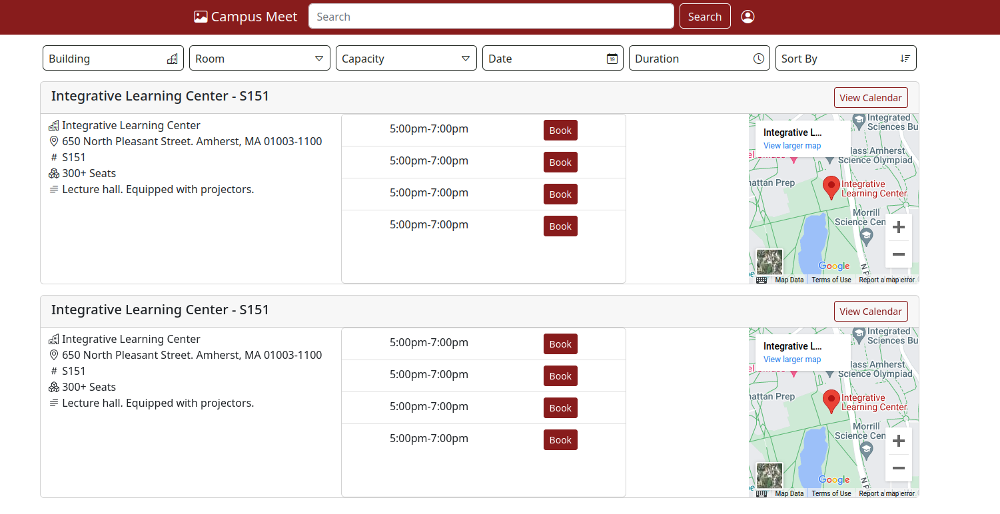

# Team &Pi;: Campus Meet - Milestone 1

## Data Interactions

Users will interact with the site through a few means.

- Searching and filtering for different room availabilities.
- View rooms in tile or calendar mode
- Booking rooms using our reserve system
- Be notified if there is a conflict

## Wireframe

### Initial Wireframe

- Initial wire frame called for a collapsible filter menu one one side. Tiles in the center, and a multi use menu on the far right. You would change view from list to calendar in a header icon not shows.
- Filter would include a searchable building, then room option. Duration and capactity would be sliders.
- Reservation modal would show at the same level as other containers.

### Revised Wireframe

- Build on Figma: <https://www.figma.com/file/k2q8tJPOWVCbH2MGZYWcVa/Campus-Meet-Wireframe?node-id=0%3A1>

- Filter options moved from a side menu to below the header. Dropdowns for building and room will include a checkbox for prior search's and search feature to add additional rooms. Everything else will be check boxes over potential options to filter the "view".
- Availability refers to if the filter shows events, exams, or empty spaces.
- View refers to the sketched "tile view" or a hidden "calendar" view.

- Clicking book will generate a modal at a level above the rest of the web. Can exit by escaping or confirming a time block.

## HTML and CSS

- Above is our navigation bar - centered - with a logo, search input, and a user icon

- Above is the filter and sorting buttons, when you hover over them they will invert the text and image colors.
- Users will be able to select buildings, specific rooms in such building, how many seats the room should have, et cetera, using popover elements.

- Above is an availability listing, the design was tweaked from the wireframe made by @AnthonyZalev
- Room listings are grouped together, with each available time having its own list entry in a sub-table.
- Available room listings will come with some details about the room, a map of the where the rooms building is, and some additional notes such as what is equipped in the building or what the room is typically used for.

- Overall this is what the index page will look like:

- Additionally, we have a template for the calendar pages
- This template will be used in a server-sided rendering routine when a user navigates to a specific rooms calendar.
- Scheduled events both in our app, and the UMass event schedule, will be dynamically inserted into the HTML, then served to the client.

## Division of Labor

- [Daniel Melanson](https://github.com/daniel-melanson)
  - Inital wireframe
  - HTML + CSS for the main page
- [Anthony Zalev](https://github.com/AnthonyZalev)
  - Inital wireframe
  - Final wireframe
- [Veera Sivarajan](https://github.com/veera-sivarajan)
  - HTML + CSS for the calendar for calendar
