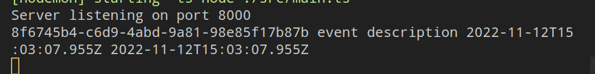

## API Descriptions

### GET /availabilities/

Get a list of available rooms and their timings based on capacity, duration, date and preferred building and room.

#### Type of response object

```ts
interface RESTfulAvailabilityField {
  start: string; // start time
  end: string; // end time
  room_id: string;
}

interface RESTfulAvailability {
  rooms: {
    [key: string]: RESTfulRoom;
  };
  availabilities: RESTfulAvailabilityField[];
}
```

### GET /buildings/

Get all the campus buildings and the rooms inside it.

#### Type of response object

```ts
interface RESTfulBuilding extends Building {
  url: string;
  name: string;
  rooms: RESTfulRoomField[];
}

interface RESTfulBuildingField {
  url: string;
  name: string;
  id: string;
}

interface Building {
  id: string;
  name: string;
}
```

### GET /buildings/:id/

Get the details of building based on `id`.

#### Type of response object

```ts
interface RESTfulBuilding extends Building {
  url: string;
  name: string;
  rooms: RESTfulRoomField[];
}

interface RESTfulBuildingField {
  url: string;
  name: string;
  id: string;
}

interface Building {
  id: string;
  name: string;
}
```

### GET /events/:id/

Get the event with the given `id`. The event details include event start and end time, title, description and room number.

#### Type of response

```ts
export interface RESTfulEvent {
  id: string;
  room: RESTfulRoomField;
  title: string;
  start_time: string;
  end_time: string;
  owner: RESTfulUserField;
}

interface RESTfulRoomField {
  url: string;
  number: string;
  id: string;
}

interface RESTfulUserField {
  id: string;
  name: string;
}
```

### POST /events/

Add a new event to database. The required event details are room number, event title, description, start time and end time as query parameters.

### GET /rooms/:id/

Get all the details for the given room `id`. The details include room capacity, address, description and the building it is located in.

#### Type of response object

```ts
interface RESTfulRoom {
  id: string;
  url: string;
  building: RESTfulBuildingField;
  number: string;
  capacity: string;
  description: string;
  address: string;
}

interface RESTfulBuildingField {
  url: string;
  name: string;
  id: string;
}
```

### GET /rooms/:id/events/

Get all events scheduled for the given room `id`. This includes the event start and end time, event title and owner.

#### Type of response object

```js
interface RESTfulEvent {
  id: string;
  room: RESTfulRoomField;
  title: string;
  start_time: string;
  end_time: string;
  owner: RESTfulUserField;
}

interface RESTfulRoomField {
  url: string;
  number: string;
  id: string;
}

interface RESTfulUserField {
  id: string;
  name: string;
}
```

## Front-End Implementation


- Above is the implementation of the filter categories
- Users can select different filter and sort options
- UI Elements will update and store relevant state internally


- Each filter change, a URL is built from the filter options and fetched
- The resulting JSON is parsed then various UI elements are created to display info


- The book button will make a modal appear
- Users will be able to input a title and a description



- A create message will display after the confirm button is clicked

## Deployment

Our application has been deployed to Heroku.

It is available at: <https://campus-meet.herokuapp.com/>

## Labor Distribution

- [Daniel Melanson](https://github.com/daniel-melanson)
  - Backend
  - Frontend scripting
- [Anthony Zalev](https://github.com/AnthonyZalev)
  - Additional Modal HTML
  - Some prototyping
- [Veera Sivarajan](https://github.com/veera-sivarajan)
  - Additional room listings HTML
  - Milestone docs
